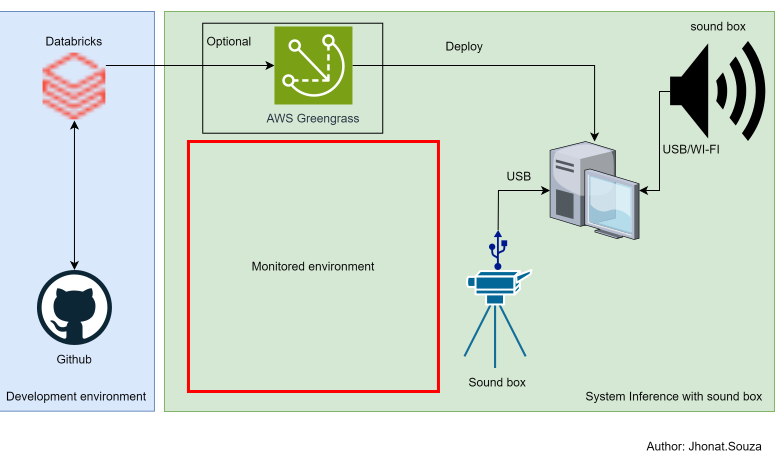
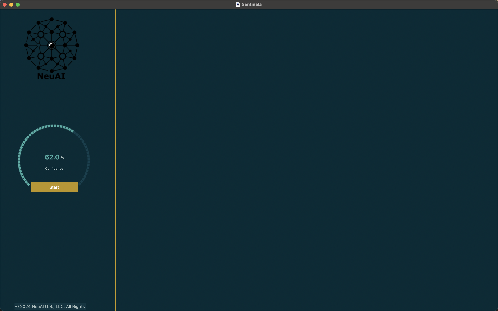

<h1 align="center">
    
</h1>

<h1 align="center">
   🙂 <a href="#">O Sentinela</a>
</h1>

<h3 align="center">
    Computer vision system, for detecting objects with alerts.
</h3>

</p>

<h4 align="center">
	 Status: development
    <!-- Status: Finished -->
</h4>

<p align="center">
 <a href="#about">About</a> •
 <a href="#features">Features</a> •
 <a href="#layout">Layout</a> •
 <a href="#how-it-works">How it works</a> •
 <a href="#tech-stack">Tech Stack</a> •
 <a href="#contributors">Contributors</a> •
 <a href="#author">Author</a> •
 <a href="#user-content-license">License</a>

</p>

## About


🌌 Computer vision system - It is a system for detecting people and glasses in real time, triggering alarms.


---

## Features

- [x] real-time glasses detection
- [x] real-time person detection
- [x] alarm activation when a person is not wearing glasses


## Model training

The model was trained using the kaggle platform:

<a href="https://www.kaggle.com/code/jhonatheberson/train-yolo-v11-with-finetuning">
  
</a>

### Application

<p align="center" style="display: flex; align-items: flex-start; justify-content: center;">
  
</p>


---

## How it works

### Download the windows executable here:

[Windows.exe](https://drive.google.com/file/d/1tx8H0NOFCiGoAWAB8kQSACvHHMkkeytP/view?usp=sharing)


<!-- Both Frontend and Mobile need the Backend to be running to work. -->

### Pre-requisites

Before you begin, you will need to have the following tools installed on your machine:
[Git](https://git-scm.com), [Python.js](https://www.python.org/downloads/release/python-3119/).


####

```bash

# Clone this repository
$ https://github.com/radixeng/computer-vision-system.git

# Access the project folder cmd/terminal
$ cd computer-vision-system

# create python virtual environment
$ python -m venv .venv

#activate python environment on windows
$ .venv\Script\activate.bat

# install the dependencies
$ pip install -r requirements.txt

# Run the application in development mode
$ python main.py

```

### Create executable Windows

Before you begin, you will need to have the following tools installed on your machine:
[PyInstaller](https://pyinstaller.org/en/latest/index.html).


####

```bash

# Clone this repository
$ https://github.com/radixeng/computer-vision-system.git

# Access the project folder cmd/terminal
$ cd computer-vision-system

# create python virtual environment
$ python -m venv .venv

#activate python environment on windows
$ .venv\Script\activate.bat

# install the dependencies
$ pip install -r requirements.txt

# script that creates executable in a single file
$ python3 .\generate_executable.py

# copy the contents of the example.spec file to main.spec

# creates the executable with dependencies
$ python3 .\generate_run_spec.py

```

---

## Tech Stack

The following tools were used in the construction of the project:

- **[Conda](https://conda.io/projects/conda/en/latest/index.html)**
- **[Yolo V11](https://docs.ultralytics.com/models/yolov11/)**
- **[Python 3.11.9](https://www.python.org/downloads/release/python-3119/)**
- **[tkinter](https://docs.python.org/pt-br/3/library/tkinter.html)**
- **[ttkbootstrap](https://ttkbootstrap.readthedocs.io/en/latest/)**
- **[OpenCV](https://docs.opencv.org/master/index.html)**
- **[Pygame](https://pypi.org/project/pygame/)**
- **[PyInstaller](https://pyinstaller.org/en/latest/index.html)**

> See the file [env.yml](https://github.com/radixeng/ROG-2024/blob/master/package.json)


---

## Contributors

A big thanks to this group that made this product leave the field of idea and enter the app stores :)

You are an awesome team! :)


<table>
  <tr>
    <td align="center"><a href="https://github.com/jhonatheberson"><br /><sub><b>Jhonat Heberson</b></sub></a><br />

  </tr>

</table>

## How to contribute

1. Fork the project.
2. Create a new branch with your changes: `git checkout -b my-feature`
3. Save your changes and create a commit message telling you what you did: `git commit -m" feature: My new feature "`
4. Submit your changes: `git push origin my-feature`
   > If you have any questions check this [guide on how to contribute](./CONTRIBUTING.md)


## License

This project is under the license [MIT](./LICENSE).

---
